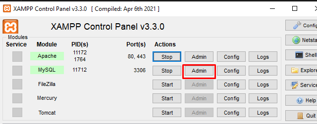
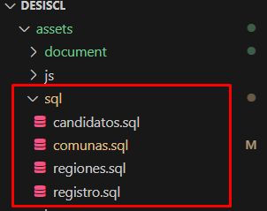
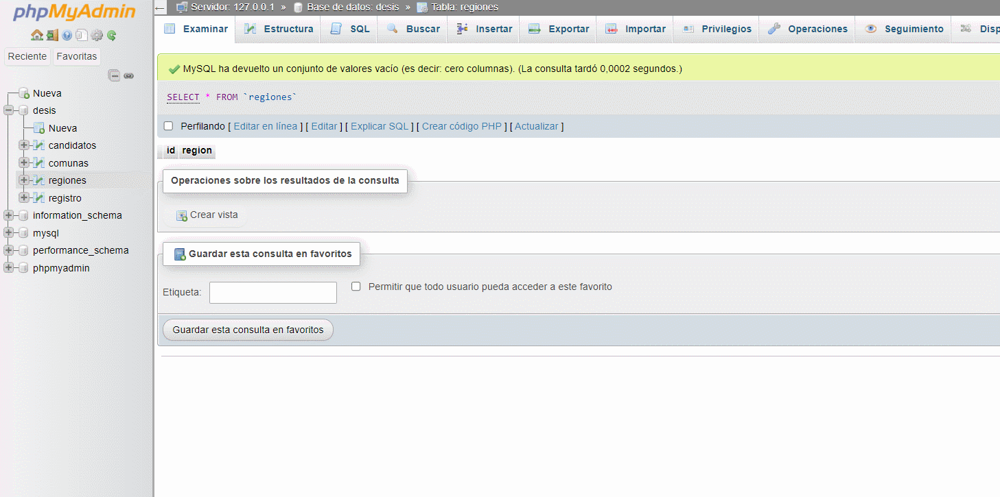
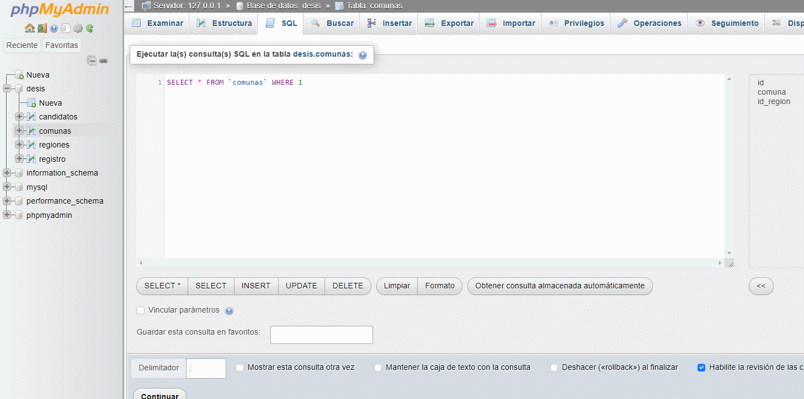
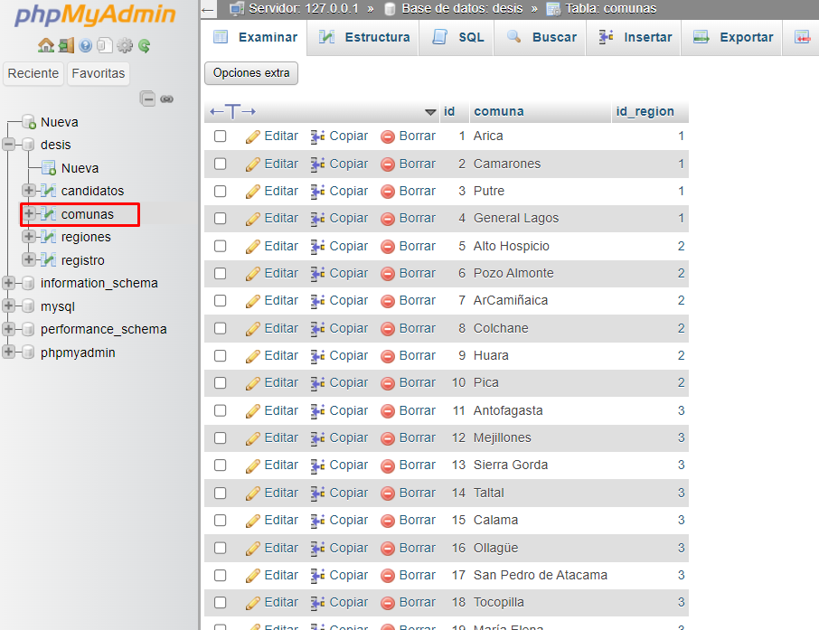
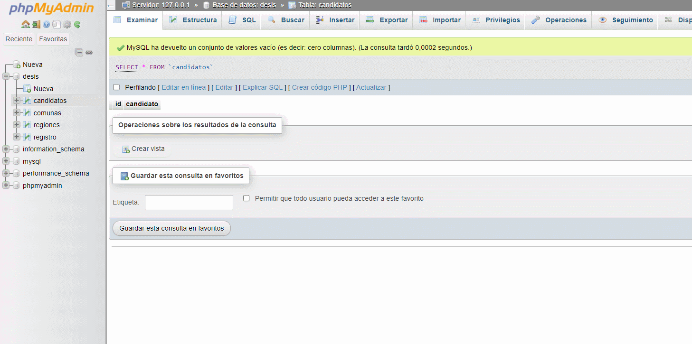
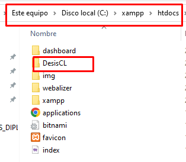
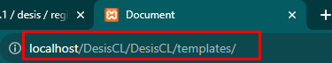
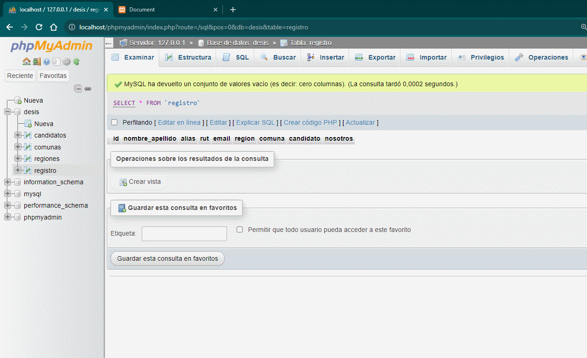
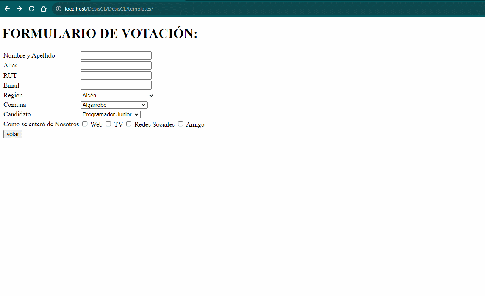

# DesisCL
```
PRUEBA DE DIAGNOSTICO DESIS.CL
```

# LENGUAJES Y HERRAMIENTAS UTILIZADOS
```
Para el desarrollo se utilozan los siguientes lenguajes de programacion, librerias, base de datos y herramientas:
    -HTML, PHP y Javascript (JQuery).
    -MYSQL - phpMyAdmin
    -Xampp ( herramienta para realizar la conección a la base de datos, como si fuera un servidor).
La version utilizada de PHP es Versión de PHP: 8.2.4. 
Version de phpMyAdmin SQL Dump version 5.2.1.
```

# CONEXION A BASE DE DATOS
```
Para crear una coneccion con la base de datos se utiliza XAMPP, conectando los servidores APACHE y MYSQL,
luego se da clic en el boton ADMIN que se encuentra en la fila MYSQL para acceder al panel phpMyAdmin.
```


# CREAR BASE DE DATOS

```
Los archivos necesarios para crear la base de datos 
se encuentran en la carpera SQL dentro de la ruta assets,
para realizar esta acción no se deben copiar las lineas 
comentadas ya que se crea conflicto con phpMyAdmin - MySQL.

Estas tablas se pueden crear manualmente o por consultas SQL, 
dentro de la pestaña SQL se deben pegar las consultas necesarias,
ES MUY IMPORTANTE insertar los datos de las comunas por bloques separados,
ya que MySQL cuenta con limite de querys.
```
```
Archivos SQL
```


```
Insertar datos en tabla REGION
```


```
Insertar datos en tabla COMUNA
```



```
Insertar datos en tabla CANDIDATO
```


# RUTA DE DESCARGA DEL REPOSITORIO
```
"C:\xampp\htdocs"
Se descarga el repositorio en la ruta especificada 
para crear una coneccion de servidor mediante la herramienta Xampp
```


# URL DEL PROYECTO
```
"http://localhost/DesisCL/templates/" 

Esta ruta se debe copiar y pegar en el navegador para acceder a la vista del formulario.
```


# INTERACCIÓN CON FORMULARIO

```
Luego de acceder a la vista se puede realizar un registro en el formulario,
los campos cuentan con validaciones para cumplir los requerimientos.
```


```
Test de validaciones
```


# Archivos PHP

```
En cada archivo se realiza una acción diferente.

- Conexion: Se crea la conexion a la base de datos.
- Registro: Envia los datos del formulario a la base de datos.
- Get_comunas: Obtiene las comunas en conjunto a la funcion AJAX.
- Candidato: Obtiene los datos de candidato insertados en la base de datos previamente.
```

